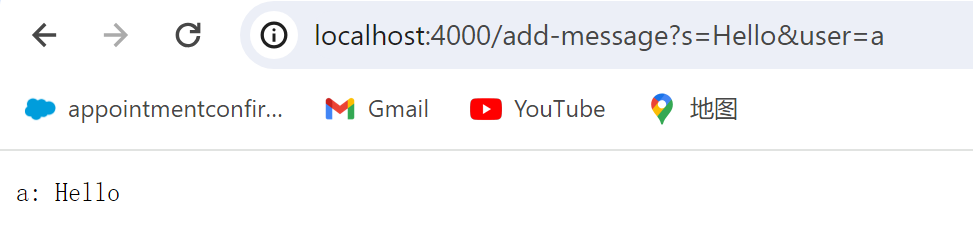
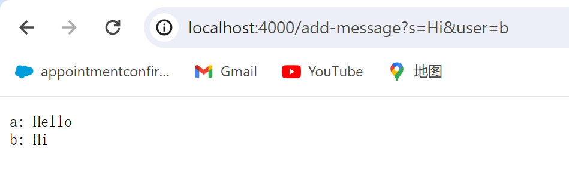
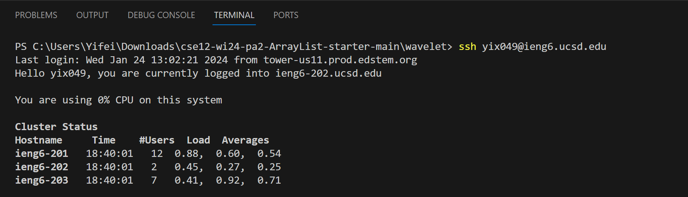
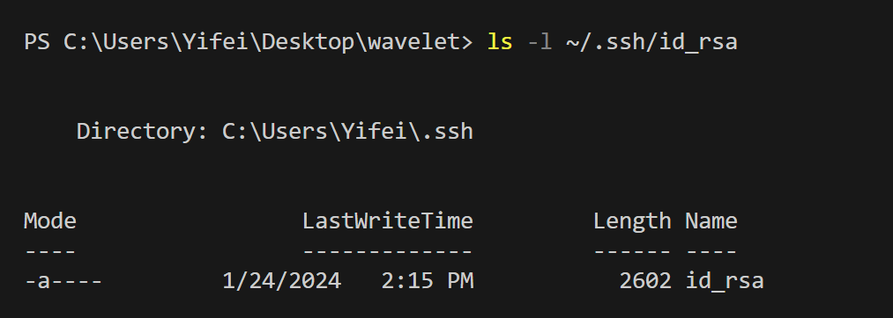
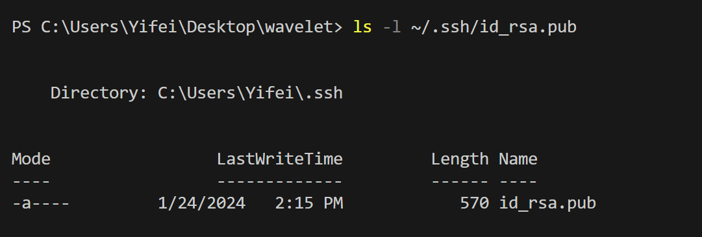

# Lab2 Report
## Part 1
```
import java.io.IOException;
import java.net.URI;

class Handler implements URLHandler {
    String outcome="";
    String page_print="";
    public String handleRequest(URI url) {
        if (url.getPath().equals("/add-message")) {
            String parameter[] = url.getQuery().split("=");
            String message= parameter[1].split("&")[0];
            String name= url.getQuery().split("user=")[1];
            outcome=name+": "+message+"\n";
            page_print+=outcome;
            return page_print;
        }  else {
            return "404 Not Found!";
        }
    }
}

public class ChatServer {
    public static void main(String[] args) throws IOException {
        if(args.length == 0){
            System.out.println("Missing port number! Try any number between 1024 to 49151");
            return;
        }

        int port = Integer.parseInt(args[0]);

        Server.start(port, new Handler());
    }
}
```

The method `handleRequest` is called.  
The argument is the `http://localhost:4000/add-message?s=Hello&user=a`.  
There are two fields in the class: `outcome`(a String), `page_print`(a String). The value of `outcome` is ` `. The value of `page_print` is ` `.  
The value of `outcome` changed to `a: Hello` when the method is called.  
The value of `page_print` changed to `a: Hello` when the method is called.


The method `handleRequest` is called.  
The argument is the `http://localhost:4000/add-message?s=Hi&user=b`.  
There are two fields in the class: `outcome`(a String), `page_print`(a String). The values of `outcome` is `a: Hello` when the method is called. The value of `page_print` is `a: Hell`o when the method is called.  
The value of `outcome` changed to `b: Hi` when the method is called.  
The value of `page_print` changed to `a: Hello b: Hi` when the method is called. 
## Part 2



## Part 3
I learned how to start a web server through codes and how to make changes on the web page through the codes.
