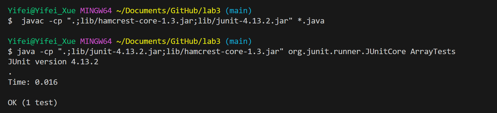
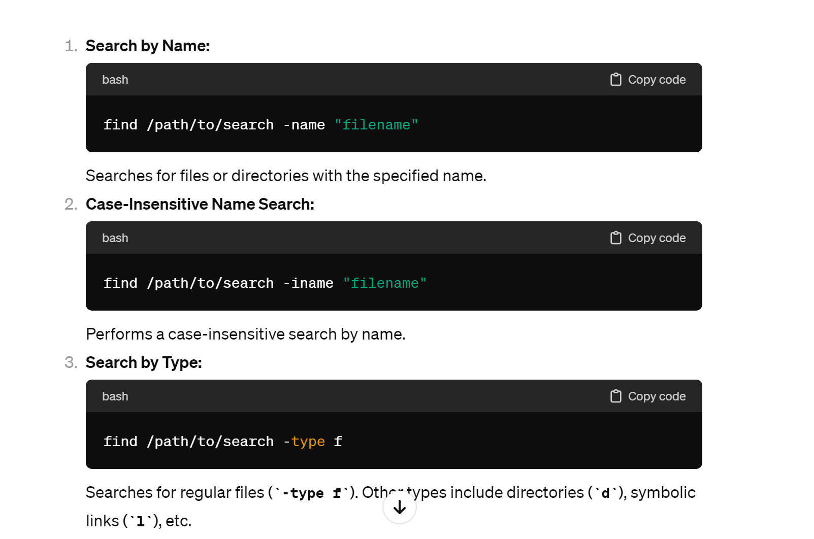
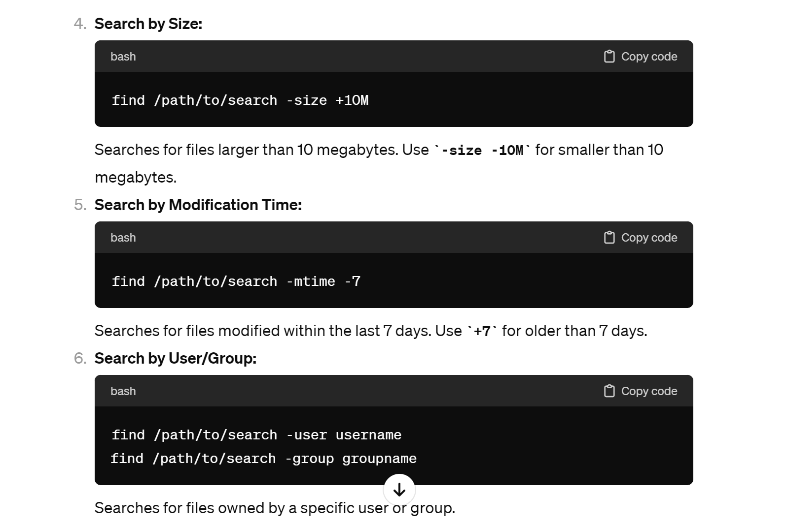

# Lab3 Report
## Part 1
The method:
```
static void reverseInPlace(int[] arr) {
    for(int i = 0; i < arr.length; i += 1) {
      arr[i] = arr[arr.length - i - 1];
    }
  }
```
The JUnit Test with `int[] input1 = { 3,4 }` as failure inducing input:
```
public void testReverseInPlaceFailureInducing() {
    int[] input1 = { 3,4 };
    ArrayExamples.reverseInPlace(input1);
    assertArrayEquals(new int[]{ 4,3 }, input1);
	}
```
The JUnit Test with `int[] input2 = { 3 }` as an input that doesn't induce a failure:
```
public void testReverseInPlaceNoFailure() {
    int[] input2 = { 3 };
    ArrayExamples.reverseInPlace(input1);
    assertArrayEquals(new int[]{ 3 }, input2);
	}
```
The symptom of failure

The symptom that doesn't induce failure

Before code change
```
static void reverseInPlace(int[] arr) {
    for(int i = 0; i < arr.length; i += 1) {
      arr[i] = arr[arr.length - i - 1];
    }
  }
```
After code change
```
static void reverseInPlace(int[] arr) {
    for(int i = 0; i < arr.length/2; i += 1) {
      int temp=arr[i];
      arr[i]=arr[arr.length-1-i];
      arr[arr.length-1-i]=temp;
    }
  }
```
The bug is induced because in the original method, the input array arr is continuously changed before reversing all the elements, so the elements that got reversed are different to the original elements. In the revised method a new array with same elements in arr is created and the new array will not be changed, so the bug can be avoided by using the new array.
## Part 2
-name option examples:  
command:  
`find . -name "1468*"`   
output:  
`./biomed/1468-6708-3-1.txt
./biomed/1468-6708-3-10.txt
./biomed/1468-6708-3-3.txt
./biomed/1468-6708-3-4.txt
./biomed/1468-6708-3-7.txt`  
-name option can search the files with specific name and patterns.In the case it searchs the file name that contains "1468".  
command:  
`find . -name 1468-6708-3-1.txt`  
output:  
`./biomed/1468-6708-3-1.txt`  
-name option can search the files with specific name and patterns. In the case it searchs the file name that contains "1468-6708-3-1.txt".  
  
-mtime option examples:  
command:  
`find . -mtime -7`  
output:  
`./biomed/1471-2334-1-13.txt
./biomed/1471-2334-1-17.txt
./biomed/1471-2334-1-21.txt
./biomed/1471-2334-1-24.txt
./biomed/1471-2334-1-9.txt
./biomed/1471-2334-2-1.txt
./biomed/1471-2334-2-24.txt
./biomed/1471-2334-2-26.txt
./biomed/1471-2334-2-27.txt
./biomed/1471-2334-2-29.txt
./biomed/1471-2334-2-5.txt
./biomed/1471-2334-2-6.txt
./biomed/1471-2334-2-7.txt
./biomed/1471-2334-3-10.txt`  (all the files in current directory, here's just the first 14 files)  
-mtime option can finds files modified within the last given days. In this case it searchs the files that can be found within the last 7 days.  
command:  
`find . -mtime -1`   
output:  
`  `(noting is returned in the terminal)  
-mtime option can finds files modified within the last given days. In this case it searchs the files that can be found within the last 1 day.   

-type f option examples:  
command:  
`find ./biomed -type f`  
output:  
`./biomed/1471-2334-1-13.txt
./biomed/1471-2334-1-17.txt
./biomed/1471-2334-1-21.txt
./biomed/1471-2334-1-24.txt
./biomed/1471-2334-1-9.txt
./biomed/1471-2334-2-1.txt
./biomed/1471-2334-2-24.txt
./biomed/1471-2334-2-26.txt
./biomed/1471-2334-2-27.txt
./biomed/1471-2334-2-29.txt
./biomed/1471-2334-2-5.txt
./biomed/1471-2334-2-6.txt
./biomed/1471-2334-2-7.txt
./biomed/1471-2334-3-10.txt`  (all the files in current directory, here's just the first 14 files)  
-type f options can search for regular files within a specified directory.  In this case it searchs the files in ./biomed directory.  
command:  
`find ./government/Post_Rate_Comm -type f`  
output:  
`./government/Post_Rate_Comm/Cohenetal_comparison.txt
./government/Post_Rate_Comm/Cohenetal_Cost_Function.txt
./government/Post_Rate_Comm/Cohenetal_CreamSkimming.txt
./government/Post_Rate_Comm/Cohenetal_DeliveryCost.txt
./government/Post_Rate_Comm/Cohenetal_RuralDelivery.txt
./government/Post_Rate_Comm/Cohenetal_Scale.txt
./government/Post_Rate_Comm/Gleiman_EMASpeech.txt
./government/Post_Rate_Comm/Gleiman_gca2000.txt
./government/Post_Rate_Comm/Mitchell_6-17-Mit.txt
./government/Post_Rate_Comm/Mitchell_RMVancouver.txt
./government/Post_Rate_Comm/Mitchell_spyros-first-class.txt
./government/Post_Rate_Comm/Redacted_Study.txt
./government/Post_Rate_Comm/ReportToCongress2002WEB.txt
./government/Post_Rate_Comm/WolakSpeech_usps.txt`  
-type f options can search for regular files within a specified directory.  In this case it searchs the files in ./government/Post_Rate_Comm directory.  


  -size option examples:  
  command:  
`find -size +100k`  
output:  
`./911report/chapter-1.txt
./911report/chapter-12.txt
./911report/chapter-13.2.txt
./911report/chapter-13.3.txt
./911report/chapter-13.4.txt
./911report/chapter-13.5.txt
./911report/chapter-3.txt
./911report/chapter-6.txt
./911report/chapter-7.txt
./911report/chapter-9.txt
./biomed/1471-2105-3-2.txt
./government/About_LSC/commission_report.txt
./government/About_LSC/State_Planning_Report.txt
./government/Env_Prot_Agen/bill.txt
./government/Env_Prot_Agen/ctm4-10.txt
./government/Env_Prot_Agen/multi102902.txt
./government/Env_Prot_Agen/tech_adden.txt
./government/Gen_Account_Office/ai9868.txt
./government/Gen_Account_Office/d01376g.txt
./government/Gen_Account_Office/d01591sp.txt
./government/Gen_Account_Office/d0269g.txt
./government/Gen_Account_Office/d02701.txt
./government/Gen_Account_Office/gg96118.txt
./government/Gen_Account_Office/GovernmentAuditingStandards_yb2002ed.txt
./government/Gen_Account_Office/im814.txt
./government/Gen_Account_Office/May1998_ai98068.txt
./government/Gen_Account_Office/pe1019.txt
./government/Gen_Account_Office/Sept27-2002_d02966.txt
./government/Gen_Account_Office/Statements_Feb28-1997_volume.txt`  
-size option can match files based on size. In this case it searchs the files that is of size greater than 100k.    
command:  
`find . -size 500c`  
output:  
`  `(nothing is returned in the terminal)  
-size option can match files based on size. In this case it searchs the files that is of size 500c.    

  Prompts I gave to chatgpt`give me some options for find command`  
  The output of chatgpt:  
    
    
  I applied four options provided by chatgpt and changed the parameter of the command to produce different output.
