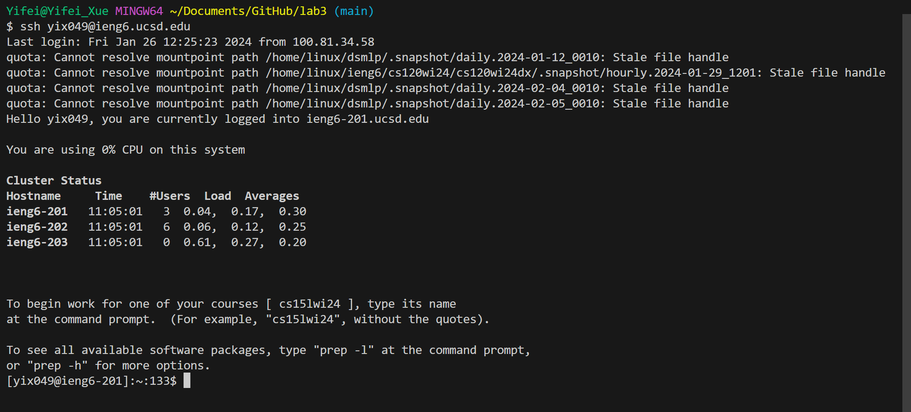
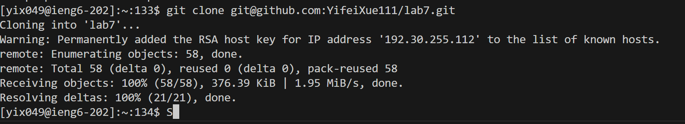
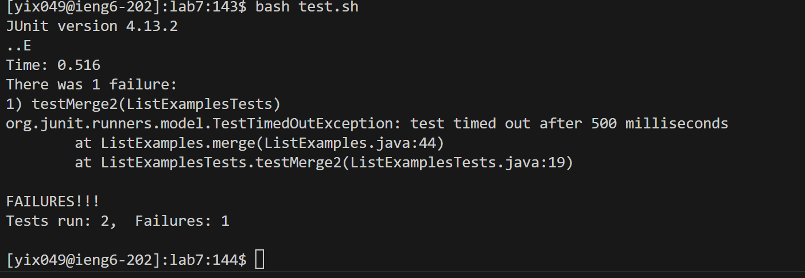
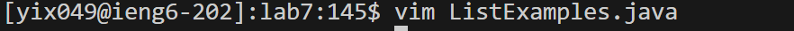
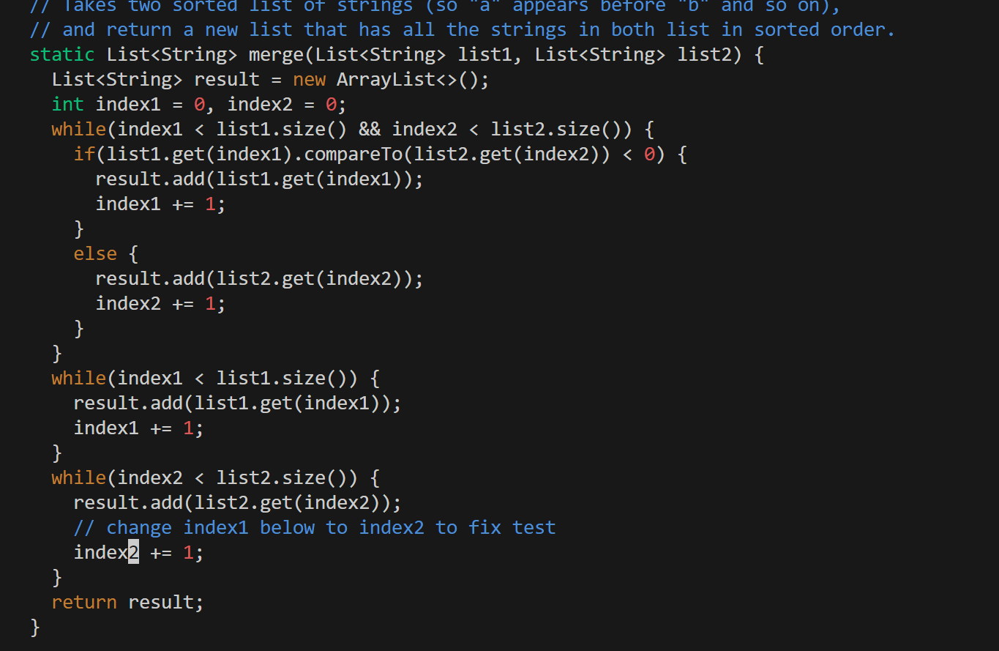
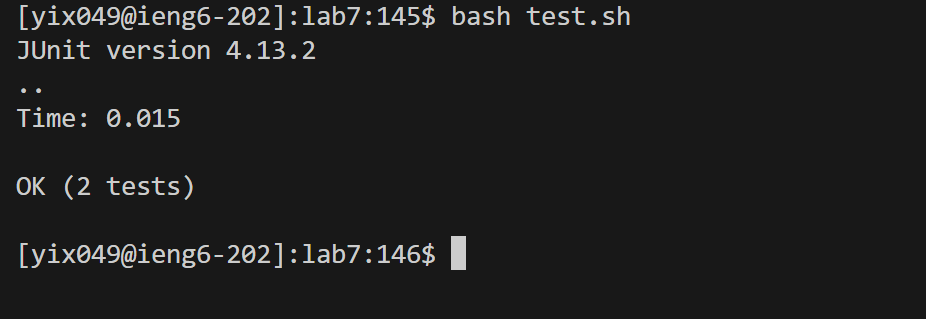
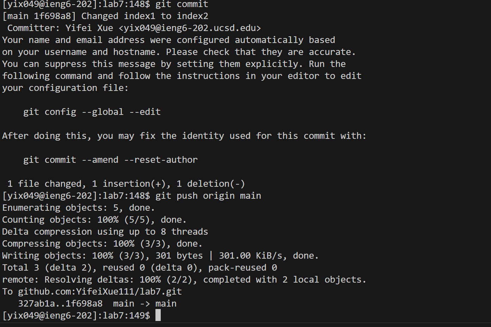

# Lab4 Report
## Step4
  
Key pressed: Type `ssh yix049@ieng6.ucsd.edu` and then press `<enter>`.  

## Step5
  
Key pressed: Type `git clone` and used `Ctrl-C` to copy the ssh key `git@github.com:YifeiXue111/lab7.git` and use `Ctrl-V` to paste the key in the terminal.  
## Step6
  
Key pressed: Type `bash test.sh` to run the test cases.  
## Step7
  
  
Key pressed: Type `vim List` and pressed `<Tab>` and type `.java` at the end. Then press `<enter>`. Press `<up><up>` to get to the line of the character that needs to be fixed, and press `<left arrow><left arrow><left arrow><left arrow><left arrow><left arrow>` to get to the character yo be fixed. Press 'i' to shift to insert mode, press `<backspace>` to delete the wrong character and pressed `2` to add the correct one. `<Esc>` is then pressed to change to normal mode, and then type `:wq` and press `<enter>` to save and exit.  
## Step8

Key pressed: Typed `bash test.sh` to run the test cases.  
## Step9

Key pressed: Typed 'git add List' and then pressed `<tab>`, so `git add ListExamples.java` is in the terminal. Then press `<enter>`. Next type `git commit` and press `enter`. Then type the message `Changed index1 to index2`, press `<Esc>` to change to normal mode, type `:wq` and press `<enter>` to save and exit. Finally type `git push origin main` and press `<enter>`.
  
