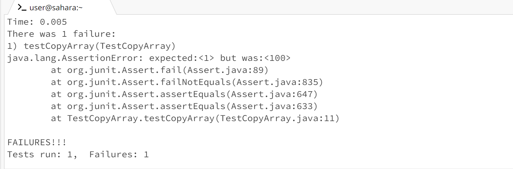
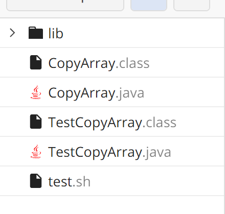
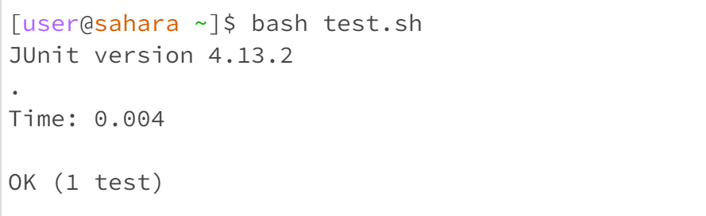

# Lab5 Report
Student Post:  
Hi! I met a problem when working with the copyArray method. This method takes an array as input, copy the input array to another array and then change the value of the first element. It is expected to return the copy of the original input array. But when I run the Junit test, the test fails and shows that the first element of the returned array is also changed. I think the problem is when I changed the value of input array, the value of the returned array is changed accordingly. I am pretty confused why the returned array is affected by the input array. Could you help me figure out why this happens? Thank you for your help.
 

TA Answer:  
It seems you created a shallow copy of the input array. The returned array and the input array are pointing to the same address. To fix this, try to create a new array when copying the input array.
## The file and directory structure  
 
## The contents of each file before fixing the bug
The contents in CopyArray.java
```
class CopyArray{
    static int[] copyArray(int[] inputArray){
        int[] returnedArray=inputArray;
        inputArray[0]=100;
        return returnedArray;
    }
}
```
The contents in test.sh  
```
javac -g -cp .:lib/hamcrest-core-1.3.jar:lib/junit-4.13.2.jar *.java
java -cp .:lib/hamcrest-core-1.3.jar:lib/junit-4.13.2.jar org.junit.runner.JUnitCore TestCopyArray
```
The contents in TestCopyArray
```
import static org.junit.Assert.*;
import org.junit.*;
import java.util.Arrays;
import java.util.List;

public class TestCopyArray{
    @Test
    public void testCopyArray(){
        int[] input={1,2,3};
        int[] result=CopyArray.copyArray(input);
        assertEquals(1,result[0]);
    }
}
```  
## The line that triggers the bug
```
 int[] returnedArray=inputArray;
```
## Fixing the bug
The student only makes the shallow copy of the input array and assign it to `int[] returnedArray`. `inputArray` and `returnedArray` are pointing to the same address, so when changing `inpoutArray`, the array saved in that addressed changed, `returnedArray` is also changed. To fix this, the student needs to create a deep copy of the `inputArray`. Instead of `int[] returnedArray=inputArray;`, the student should do the following:
```
int[] returnedArray=new int[inputArray.length];
        for(int i=0;i<inputArra.length;i++){
            returnedArray[i]=inputArray[i];
        }
```
## The output after fixing
 

The skill that impressed me the most is using vim and jdb. It is cool to edit the file using vim in the terminal, and it is useful to use jdb to debug when no knowing what's going wrong.

